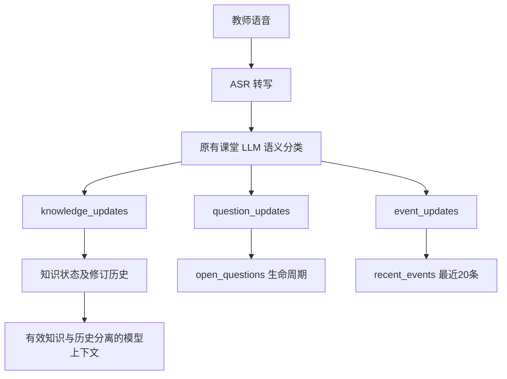

# V1 认知状态管理改造说明

## 一、为什么要修改

原先“学生学到了什么”和“课堂发生了什么”混在一起。在真实星星运算课堂记录中，“老师宣布今天的星星运算学习到这里结束”被保存为 `k_star_lesson_end`，状态是 `understood`。结束上课是事件，不能成为以后计算或推理使用的知识。

## 二、这次修改解决了什么

- `knowledge`：可用于推理的定义、概念、规则、因果和方法。
- `open_questions`：尚需回答或解释的问题及其生命周期。保留 resolved 记录用于防止重复追问。
- `recent_events`：开场、任务、回答请求、结束及组织语言，最多最近 20 条。

分类由原有课堂 LLM 在同一次结构化输出中完成，没有单独增加分类调用。程序校验来源、修订关系与事件上限，不使用“今天”“吗”等关键词机械分类。

## 三、修改前后的数据流

以前：教师语音 → ASR → 课堂 LLM → 知识和问题更新；课堂事件可能混入 knowledge。

知识同 ID 更新时保存旧版本；使用新 ID 纠正旧知识时，通过 `supersedes` 关联旧条目。旧版 `questions` 输入仍可读取，新的状态日志输出 `open_questions`。已有问题去重、提问次数和解决规则继续保留。

## 四、知识状态现在是什么意思

| 状态 | 含义 |
|---|---|
| tentative | 形成初步认知，还需谨慎使用 |
| understood | 根据课堂回答、解释、应用等表现推断理解 |
| conflict | 冲突或失效，退出当前有效知识集合 |
| unclear | 缺少必要信息，不作为当前确定规则 |

**understood ≠ verified mastery。当前没有 verified 状态。** 教师说“答对了”、学生说“懂了”和普通课堂正确回答，都不会产生 verified。

## 五、教师纠正知识时发生什么

旧规则 `a ★ b = a + b` → 教师纠正 → 旧条目成为 conflict，或旧版本进入 knowledge_history → 新规则 `a ★ b = a + b - 1` 根据课堂表现成为 tentative/understood。

历史保存原内容、原状态、来源、修订版本及替代 ID。保留旧规则是为了展示认知如何变化，不是允许继续使用它。模型当前知识集合只包含 tentative/understood；冲突、信息缺失与修订历史分开放置，并提示模型遵循后续明确纠正。原始课堂来源仍保留，因此语义遵循仍需模型理解。

## 六、Assessment 有没有变化

本地已完成的主流程继续保持：生成题目 → audit → AI 学生独立作答 → evaluation → 保存 assessment_result。作答请求不包含参考答案和评分标准，评估结果不写回课堂知识。

**相对远程 main 的范围需要特别说明：** 基准 main 尚无 Assessment 文件和入口。因此此 PR 同步已在本地实现和测试的 Assessment 配套源码、前端和回归测试，避免认知代码引用不存在的模块。本轮没有重新设计测验。新增认知改造对 Assessment 的改动只是上下文兼容。

## 七、为什么暂时没有 verified

测验学习目标及评分依据主要是文本，没有可靠映射到具体 knowledge ID。一次测验 passed 不足以把若干知识一起标成 verified。当前分开保存：understood 是课堂推断，assessments 是独立测验证据。这是正确性上的选择。

## 八、真实测试案例：星星运算

使用原始日志的教学片段进行真实模型文字回放，另加未讲规则和纠正未讲完整的检查：

1. 未讲规则时，学生表示尚未学过，未凭预训练知识补全。
2. 第一版规则是两数相加；第一轮应用测验判断 `5 ★ 2 = 7`，结果 passed/sufficient。
3. 老师仅声明旧规则不完整时，学生表示还无法给出完整规则，没有猜出“减 1”。
4. 讲完新规则后，学生回答 `3 ★ 3 = 3 + 3 - 1 = 5`。
5. 第二轮应用测验判断 `7 ★ 2 = 9` 是错误的，并给出正确结果 8，结果 passed/sufficient。
6. 结束语进入 lesson_end 事件，没有生成 k_star_lesson_end 知识。
7. 两轮结果均写入 assessment_result 及 finished.assessments，没有自动升级知识状态。

本地证据会话包括 `d1494d7ef1a0` 和本次重新执行的 `1bbf756b02cb`。本次真实模型第二轮指出只算 6+2=8 不完整，并按纠正后的规则得到 **6 ★ 2 = 7**；两轮均 passed/sufficient。最新回放采用同 ID 更新，新规则为 understood，旧内容及冲突过程保存在 6 条 knowledge_history 修订中。原始课堂文本、完整模型输入输出和凭据均不提交。本例是文字回放，不是重新执行原始音频 ASR。动态题目的新颖性、难度与可比性仍需人工复核。

## 九、测试结果

改造完成时原始本地项目的全套测试为 **102 passed、2 skipped、0 failed**；其中 cognition 14 项、Assessment 29 项。自动化测试主要为单元测试、mock 模型和协议回归，不冒充真实模型测试。

真实回放另外调用了实际配置模型：8 次课堂处理、2 轮测验的四个阶段各调用 2 次；两个测验 passed/sufficient，结束记录包含 2 条结果，无错误和未处理来源。

提交副本重新执行全套测试：**98 passed、3 skipped、0 failed**，其中 cognition 14 项、Assessment 29 项均通过。标准 Windows pytest 曾因已有超长 PCM 参数 ID 报环境变量超过 32767 字符；仅为该测试增加短 ID，不修改业务逻辑或断言。后续重新使用标准 `python -m pytest -q` 验证，不再需要临时插件。与原项目数量不同是因为排除了 3 项独立 Windows 语音测试，且提交副本不带本地模型，真实 VAD 测试另行跳过。前端 app.js、assessment.js、asr-debug.js 语法检查及 git diff --check 通过；提交副本后台与首页 HTTP 启动检查均返回 200。两个原测试跳过项是可选真实 ASR 样本测试、Windows 符号链接权限测试。前端完整人工操作、原始音频 ASR 重跑、长课堂稳定性尚未验证。

## 十、修改文件说明

| 文件 | 修改内容 | 为什么修改 |
|---|---|---|
| `README.md` | 运行方式、状态语义及限制 | 为审核提供完整可运行代码和证据 |
| `backend/app.py` | 注册既有测验消息路由 | 为审核提供完整可运行代码和证据 |
| `backend/assessment.py` | 已实现的动态测验及新的状态上下文兼容 | 为审核提供完整可运行代码和证据 |
| `backend/policy.py` | 保留修订、纠正关系、事件上限 | 为审核提供完整可运行代码和证据 |
| `backend/prompts.py` | 课堂语义分类与知识边界 | 为审核提供完整可运行代码和证据 |
| `backend/schemas.py` | 新增分类结构、历史与兼容字段 | 为审核提供完整可运行代码和证据 |
| `backend/session.py` | 传递有效知识及历史、接入既有测验 | 为审核提供完整可运行代码和证据 |
| `docs/V1认知状态改造说明.md` | 本次中文说明 | 为审核提供完整可运行代码和证据 |
| `frontend/app.js` | 测验交互、录音互斥及新状态显示 | 为审核提供完整可运行代码和证据 |
| `frontend/assessment.js` | 已有测验前端入口与结果显示 | 为审核提供完整可运行代码和证据 |
| `frontend/index.html` | 挂载已有测验组件 | 为审核提供完整可运行代码和证据 |
| `frontend/style.css` | 已有测验组件样式 | 为审核提供完整可运行代码和证据 |
| `scripts/verify_assessment.py` | 真实测验链路验证 | 为审核提供完整可运行代码和证据 |
| `scripts/verify_cognition.py` | 原始星星运算教学片段回放 | 为审核提供完整可运行代码和证据 |
| `tests/live_smoke.py` | 问题字段适配 | 为审核提供完整可运行代码和证据 |
| `tests/test_assessment.py` | 29 项已有测验回归 | 为审核提供完整可运行代码和证据 |
| `tests/test_asr_debug.py` | 仅为已有 PCM 参数补充短测试 ID | 避免 Windows 环境变量长度限制，不改变断言或业务 |
| `tests/test_cognition.py` | 14 项认知状态回归 | 为审核提供完整可运行代码和证据 |

## 十一、这次没有做什么

没有做 Token 压缩、verified、认知地图、多 Agent、RAG、无关 UI 大改或 Assessment 流程重写。Windows 语音模块、品牌改名和单独课堂演示文案在审核副本中排除，保留 main 的相应实现。保留远程原有 macOS 启动脚本，不因本地缺失而删除。

## 十二、仍然存在的问题

语义分类及对纠正的理解仍依赖 LLM；ASR 错误仍可能影响认知。长课堂 Token 增长尚未解决，长课堂稳定性没有完整验证。Assessment 尚未可靠映射知识 ID。

模型上下文明确区分有效知识与历史，但这不能让预训练模型真正遗忘，也不能确定性证明每句话的语义来源。旧日志不自动迁移或清洗。

真实回放脚本需要另行提供原始课堂日志和配置 API 密钥；课堂日志因隐私与调试数据不进入仓库。运行真实测试会使用实际模型服务额度。
