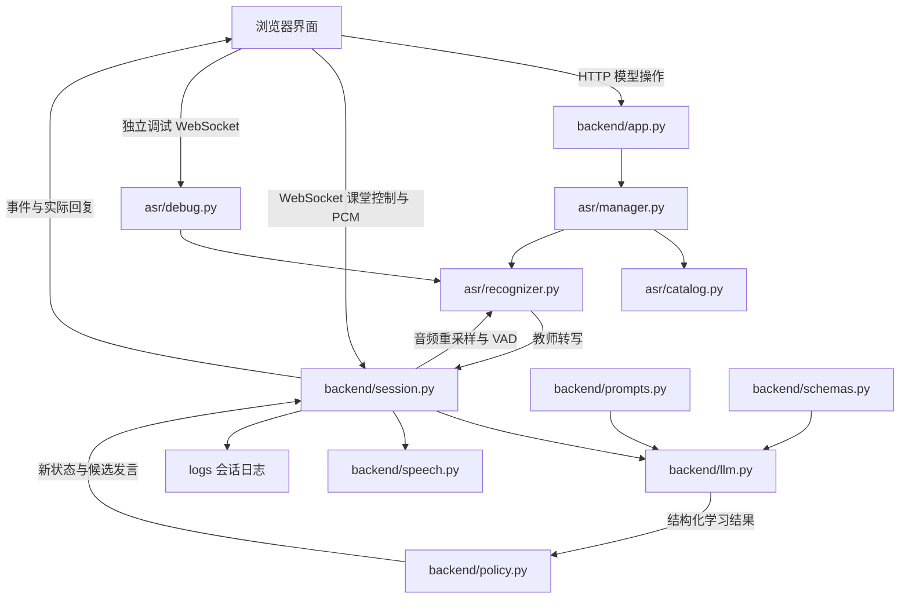
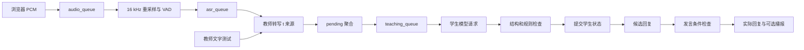

# Learn From You 项目架构与逐文件说明


整理日期：2026 年 10 月 5 日  
整理截止节点commit ID：b8e3c6b308ad53642fd823edb8c1009532ccff1d


项目名称：讲给我听 · Learn From You  

本文用于理解现有项目如何运行、各文件负责什么，以及修改一个功能时应该从哪里入手。内容对应当前源码与本地文件快照；描述的是现有实现，不把产品设想当作已经完成的功能。本次仅进行源码和文件分析，没有运行测试、下载模型或调用收费接口。

逐项覆盖项目源码、配置、脚本、测试、已有设计资料和现有日志。`asr/models/` 中下载的权重、词表、样本等不逐文件展开，只说明存储约定；`.venv/` 中第三方依赖和 `.git/` 内部数据按目录说明，Python 与 pytest 缓存单独列出。

## 1 整体架构

项目是一个本机运行的 AI 学生试讲工具。浏览器采集教师语音，本地 ASR 将语音识别成文字，云端大模型根据前置知识和本次课堂文字更新学生认知，程序检查发言条件后返回学生回复，并可通过 macOS 系统语音播报。

当前前端是开发调试界面，包含试讲课堂、模型管理和独立 ASR 调试。后端是单个 FastAPI 服务；没有数据库、账号体系或跨课堂长期记忆。

| 层次 | 主要文件 | 职责 |
| --- | --- | --- |
| 启动与运行配置 | `run.py`、启动脚本、`backend/config.py` | 启动本机服务，读取密钥、端口、线程和时间参数 |
| 浏览器界面 | `frontend/index.html`、`style.css`、`app.js` | 课程输入、操作控制、模型管理、课堂状态和调试记录展示 |
| 浏览器录音 | `audio-worklet.js`、`pcm-recorder.js`，以及 `app.js` 内的课堂录音逻辑 | 采集单声道 Float32 PCM，发送音频帧，停止时提交尾帧 |
| 服务接口 | `backend/app.py` | HTTP 页面与模型管理接口、两条 WebSocket、来源检查和资源归还 |
| 模型管理与本地识别 | `asr/catalog.py`、`manager.py`、`recognizer.py` | 固定下载清单、安装校验、模型选择、按需加载、VAD 和识别 |
| 课堂编排 | `backend/session.py` | 音频与文字队列、课堂来源、模型学习、状态更新、发言时机、日志 |
| 学生行为与数据契约 | `backend/prompts.py`、`schemas.py`、`policy.py` | 提示词、结构校验、来源检查、问题生命周期、发言限制 |
| 云端模型和声音 | `backend/llm.py`、`speech.py` | 模型请求与结果解析；本机系统播报 |
| 开发验证 | `tests/`、`scripts/`、`.github/workflows/test.yml` | 行为回归、模型下载模拟、平台 CI、禁止提交模型 |



图中的两条 WebSocket 均由 `backend/app.py` 接收并分发。课堂与独立 ASR 调试共享同一个 `ModelManager` 的占用状态，不能同时运行；模型下载与识别占用也互斥。

## 2 项目目录

```text
LearnFromYou/
├── .env                         本机密钥与运行配置
├── .env.example                 配置模板
├── .gitignore                   Git 忽略规则
├── .github/workflows/test.yml   持续集成
├── README.md                    项目安装与使用说明
├── requirements.txt             Python 依赖
├── run.py                       服务启动入口
├── 启动试讲.command              macOS 启动入口
├── 启动试讲.bat                  Windows 启动入口
├── 你好.txt                      独立文本文件
├── backend/                     服务与 AI 学生逻辑
├── asr/                         本地语音识别与模型管理
│   └── models/                  下载模型和本机选择状态
├── frontend/                    开发调试网页
├── tests/                       自动化测试与真实链路测试
├── scripts/                     仓库检查脚本
├── logs/                        按会话生成的事件日志
├── docx/                        产品资料与本文
├── .venv/                       本机 Python 虚拟环境
├── .pytest_cache/               pytest 运行缓存
└── 各目录的 __pycache__/         Python 字节码缓存
```

## 3 根目录文件与持续集成

### 3.1 `run.py`

服务启动入口。导入 `backend.config.PORT`，在直接运行时调用 `uvicorn.run("backend.app:app", host="127.0.0.1", port=PORT, access_log=False)`。

只绑定本机回环地址；没有开启代码自动重载。Python 后端代码修改后需要重启服务。`access_log=False` 关闭 Uvicorn 的访问日志，不影响 `Session` 写入课堂事件日志。

### 3.2 `启动试讲.command`

macOS 的便捷启动脚本。切换到脚本所在的项目目录，打开 `http://127.0.0.1:8765`，再用项目 `.venv/bin/python` 执行 `run.py`。浏览器先打开，服务随后启动，因此页面可能需要稍后刷新。

脚本里的浏览器地址固定为 8765；修改 `.env` 的 `PORT` 会改变服务端口，但不会同步改这个地址。

### 3.3 `启动试讲.bat`

Windows 的便捷启动脚本。切换到脚本目录，打开默认本机地址，调用 `.venv\Scripts\python.exe run.py`，最后 `pause` 保留窗口。同样固定使用浏览器端口 8765。它解决启动方式，不代表 TTS 已完成 Windows 适配。

### 3.4 `requirements.txt`

声明项目的直接 Python 依赖和版本范围：FastAPI / Uvicorn 提供服务，httpx 请求模型与下载文件，anyio 辅助取消保护，python-dotenv 读取配置，websockets 用于真实链路测试，Pydantic 校验数据，NumPy 处理音频，sherpa-onnx 运行本地识别和 VAD，soundfile 读取音频，pytest 运行测试。

`sherpa-onnx` 固定为 1.13.8，其他依赖主要使用版本范围。这不是锁定所有间接依赖的完整 lock 文件。当前 README 要求 Python 3.11 及以上。

### 3.5 `.env`

本机运行配置，由 `backend/config.py` 读取。用于保存真实 API 密钥和可选运行参数，不参与前端脚本打包，不应提交到 Git。本文不复制它的内容。

### 3.6 `.env.example`

供新安装者复制的配置模板。包含密钥占位符、LLM 接口地址与模型、ASR 线程数、播报声音、端口，以及分段和发言的停顿时间。ASR 选择通过模型页面管理，不再通过 `ASR_MODEL_DIR` 配置。

### 3.7 `.gitignore`

忽略 `.env` 和其他 `.env.*`，但保留 `.env.example`；同时忽略 `.venv/`、整个 `/asr/models/`、`logs/`、`__pycache__/`、`.pytest_cache/` 和 `.DS_Store`。

`docx/` 没有整体被忽略，产品资料和 Markdown 文档可以进入版本管理。忽略规则不会自动移除已经被 Git 跟踪的文件。

### 3.8 `README.md`

项目总说明：定位、开发界面说明、依赖安装、密钥配置、模型配置、macOS / Windows 使用方式、试讲步骤、本地与云端边界、默认时间规则、测试命令和已知限制。它提供使用层面的说明，具体运行行为由源码决定。

### 3.9 `.github/workflows/test.yml`

GitHub Actions 工作流。在 push 和 pull request 时执行，矩阵包含 macOS、Windows 和 Python 3.11、3.13，共四种组合。流程为检出仓库、设置 Python、检查模型未被提交、安装依赖、运行 `pytest -q`。

它没有运行 `tests/live_smoke.py`，因此 CI 不会主动调用真实 DeepSeek 接口；模型下载测试使用模拟 HTTP。工作流配置说明计划覆盖的平台，不能单凭配置声称最近一次 CI 已通过。

### 3.10 `你好.txt`

当前内容为“这是什么都没有”。没有在项目源码中发现被读取或引用的代码，不参与启动、ASR、试讲和测试链路。

## 4 backend 逐文件说明

### 4.1 `backend/__init__.py`

基本为空，用于将 `backend` 标记为 Python 包，支持 `backend.app` 等导入路径。没有业务初始化逻辑。

### 4.2 `backend/config.py`

统一计算项目根目录，并用 `load_dotenv(ROOT / ".env", override=False)` 读取本机配置。已有进程环境变量优先于 `.env`。

| 配置 | 默认值或来源 | 作用 |
| --- | --- | --- |
| `ROOT` | 源码位置向上两级 | 项目目录，避免依赖启动时的工作目录 |
| `API_KEY` | `DEEPSEEK_API_KEY`，兼容 `Deepseek_API` | 后端请求云端模型的认证 |
| `BASE_URL` | `https://api.deepseek.com` | 兼容 Chat Completions 的服务地址 |
| `MODEL` | `deepseek-chat` | AI 学生使用的云端模型 |
| `MODELS_DIR` | `ROOT / "asr/models"` | 固定模型存储目录 |
| `ASR_THREADS` | 2 | 本地识别线程数 |
| `SEGMENT_PAUSE` | 3 秒 | 普通教学文本提交等待时间 |
| `LONG_PAUSE` | 1 秒 | 文本超过 300 字时的停顿阈值 |
| `SEGMENT_MAX_WAIT` | 20 秒 | 稳定待处理文本的最长等待时间 |
| `SPEAK_PAUSE` | 5 秒 | 未被点名时主动提问的停顿阈值 |
| `DIRECT_PAUSE` | 1 秒 | 被点名时的分段和发言停顿阈值 |
| `TTS_VOICE` | `Tingting` | macOS 系统语音名称 |
| `PORT` | 8765 | HTTP / WebSocket 本机服务端口 |

这些配置在模块导入时读取；修改后通常需要重启后端。VAD 的切段参数另在 `asr/recognizer.py` 中定义。

### 4.3 `backend/app.py`

FastAPI 应用入口与资源协调层。模块创建一个共享的 `ModelManager`，保留 `active_session`，挂载前端静态资源。启动时没有立即加载大型识别模型；在课堂或 ASR 调试开始时按需申请。

`lifespan()` 在服务退出时关闭活动课堂，并调用模型管理器清理下载任务和识别资源。`local_origin()` 检查来源是否是当前端口的本机 HTTP 页面。`protect_local_actions()` 阻止带外部来源或跨站标记的 POST，并对页面和静态文件设置 `Cache-Control: no-store`。

| 方法与路径 | 实现函数 | 职责 |
| --- | --- | --- |
| GET `/` | `index()` | 返回开发调试页面 |
| GET `/models` | `models_page()` | 返回同一个 HTML，由浏览器显示模型页 |
| GET `/api/health` | `health()` | 返回 ASR 就绪、模型加载状态、占用用途、LLM 是否配置等 |
| GET `/api/asr/models` | `model_list()` | 返回安装情况、选择、下载进度和模型目录 |
| POST `/api/asr/models/{model_id}/download` | `download_model()` | 启动后台下载或修复，立即返回任务状态 |
| POST `/api/asr/models/{model_id}/cancel` | `cancel_download()` | 发出下载取消信号 |
| POST `/api/asr/models/{model_id}/select` | `select_model()` | 选择已安装模型并持久化；占用时返回 409 |
| POST `/api/asr/open-folder` | `open_model_folder()` | 打开本机模型文件夹 |
| WebSocket `/ws/session` | `websocket()` | 课堂控制 JSON 与二进制音频 |
| WebSocket `/ws/asr-debug` | `asr_debug()` | 独立录音识别测试，不创建学生课堂 |
| 静态路径 `/static/` | `StaticFiles` | 提供 JS、CSS 等前端文件 |

课堂 WebSocket 的控制消息为 `start`、`audio_start`、`audio_stop`、`text`、`flush`、`mute`、`tts`、`stop_speech`、`retry`、`end`。音频通过二进制帧传递。

课堂开始时先校验 `Lesson`，再向管理器申请模型，创建 `Session`，执行课前准备。结束、课前失败、连接断开时归还模型。`owns_engine` 标志保证没有申请成功的连接不会释放其他连接的模型。

独立调试只接受 `start`、音频帧和 `stop`，并同时观察接收任务与后台识别任务。识别任务出错时即使浏览器没有再发送音频，也会报告错误并清理资源。部分清理用 anyio 的取消保护，确保原生工作线程完成释放。

### 4.4 `backend/session.py`

`Session` 是每次课堂的核心对象。它维护本次课堂的完整运行状态，并启动四个并行循环；学习结果仍按教学队列顺序提交。

| 数据成员 | 保存内容 |
| --- | --- |
| `state` | 当前学生知识、问题和版本号 |
| `sources` | 前置知识 `p1…` 与教师文字 `t1…` 的来源表 |
| `processed_ids` | 已成功学习的教师来源编号 |
| `prerequisites` | 明确输入的前置知识 |
| `history` | 已实际发出的学生回复 |
| `pending` | 已转写但尚未形成教学批次的文字 |
| `audio_queue` | 原始 PCM 帧，容量 240 |
| `asr_queue` | VAD 切出的语音段，容量 30 |
| `teaching_queue` | 待调用模型的文字批次，无显式容量上限 |
| `revision` | 教师输入修订号，用于废弃旧候选发言 |
| `candidate` | 模型产生、但尚未实际发出的候选回复 |
| `failed_batch`、`retry_event` | 失败批次与用户重试信号 |
| `muted`、`tts_enabled` | 是否允许对外回复，以及是否播放声音 |
| `ready`、`finishing`、`closed` | 课堂生命周期标志 |

主要方法职责如下：

| 方法 | 职责 |
| --- | --- |
| `__init__()` | 创建状态、队列、模型客户端和播报器，生成 12 位会话编号 |
| `emit()` | 生成带 UTC 时间和经过秒数的事件；隐藏已配置密钥；写 JSONL，并发送前端 |
| `start()` | 创建日志、请求课前范围，将前置知识按换行或分号拆成 `p` 来源，启动四个循环 |
| `start_audio()` | 校验 8–96 kHz 采样率，创建本次录音的 `AudioStream` |
| `accept_audio()` | 将小端 Float32 PCM 转成 NumPy 数组，校验长度和有限数值，入队；积压时停止接收新音频 |
| `audio_loop()` | 重采样、VAD、切段；教师开始讲话时使候选过时并停止学生播报 |
| `asr_loop()` | 调用本地识别器，将非空结果加入教师来源；记录识别耗时和音频时长 |
| `add_transcript()` | 接收文字或 ASR 结果，分配 `t` 编号，更新修订号，加入待聚合列表 |
| `stop_audio()` | 等待音频队列完成，提交 VAD 尾段，等待识别完成，再释放录音处理对象 |
| `flush()` | 将待聚合文字送进教学队列，记录提交原因和来源列表 |
| `payload()` | 组装当前范围、前置知识、状态、新内容及相关历史来源；保留最近八条教师来源与最近八条学生发言作为上下文的一部分 |
| `learn_loop()` | 最多合并四个已排队批次；请求模型、执行规则校验、提交状态、生成候选；失败则保留批次并等待重试 |
| `clock_loop()` | 每 0.15 秒检查无音频提示、分段条件和发言条件 |
| `try_speak()` | 经过静音、修订、积压、讲话、停顿等检查后发出回复；实际提问此时才计数 |
| `say()` | 异步播报回复，报告播报开始、结束和失败 |
| `stop_speech()` | 停止系统语音进程，并取消播报任务 |
| `set_muted()` | 更新静音状态；开启静音时删除待发候选并停止声音 |
| `finish()` | 停止录音和声音、提交剩余文字；最多等待约 100 秒的最后学习处理，列出未处理来源，关闭课堂 |
| `close()`、`_close_resources()` | 复用同一个受取消保护的清理任务，取消循环，关闭识别器、HTTP 客户端和日志 |

重要行为：模型失败不会自动跳过批次；后续教学内容仍排队。新教师输入可以使旧候选回复失效，但不会撤销已经成功提交的认知更新。结束时 `finishing` 会阻止继续发言。

### 4.5 `backend/llm.py`

`ModelClient` 封装云端模型通信，`ModelError` 是面向课堂的模型异常类型。

`generate(phase, system, payload, output_type)` 将提示词和 `output_type` 的 JSON Schema 放进 system 消息，将课堂数据序列化为 user 消息，POST 到 `BASE_URL + "/chat/completions"`。请求使用 `json_object` 输出、temperature 0.25、max_tokens 3500；HTTP 总超时 90 秒，连接超时 15 秒。

发送前记录 `llm_request`，收到结果后记录 `llm_output`、耗时和 token 用量；认证头不加入请求日志。返回文本通过 Pydantic 校验。结构错误时附上原输出，要求修复一次，最多两次模型生成；网络或 HTTP 错误直接交给会话的人工重试流程，没有同等的自动网络重试。`close()` 关闭异步 HTTP 客户端。

### 4.6 `backend/prompts.py`

保存两段提示词常量。

- `PREPARE`：只从课程输入提取短主题标签和边界说明，不展开教材或答案。课程名称代表待学范围，不代表学生掌握了知识。
- `STUDENT`：定义学生身份、课堂领域知识边界、逐步形成理解、来源编号、问题去重与关闭、未知内容如何回答、简短自然回复和 JSON 输出。

提示词要求把课堂输入当作数据，避免输入改变学生身份；要求认知依据简短，不输出长篇思维过程。它提供模型行为约束，实际结构、引用和发言检查由 `schemas.py` 与 `policy.py` 执行。

### 4.7 `backend/schemas.py`

使用 Pydantic 定义输入、模型输出与学生状态。所有模型继承 `StrictModel`，通过 `extra="forbid"` 拒绝未声明字段。

| 类型 | 主要字段与职责 |
| --- | --- |
| `StrictModel` | 统一严格字段规则 |
| `Lesson` | `topic`、`points`、`prerequisites`、`level`；主题必填，限定长度 |
| `Preparation` | `scope`、`boundary_note`；课前分析结果，最多 12 个主题 |
| `Knowledge` | `id`、`text`、`status`、`sources`；状态为 tentative / understood / unclear / conflict |
| `QuestionUpdate` | 问题编号、主题、正文、状态、来源、解决来源；供模型更新问题 |
| `Question` | 在问题更新结构上增加程序控制的 `attempts` |
| `Candidate` | silence / answer / question / ack；包含正文、问题编号和来源 |
| `StudentResult` | 知识更新、问题更新、是否被点名、候选发言、简短依据 |
| `StudentState` | `version`、全部知识、全部问题；本次课堂累计状态 |

结构校验检查类型、长度和枚举，不证明知识内容正确。`understood` 是学生当前理解的标签，不是外部标准答案认证。

### 4.8 `backend/policy.py`

确定性规则层，在模型建议与实际状态、发言之间做检查。

- `invited(text)`：用中文正则识别“你理解了吗”“请回答”“能解释吗”等邀请。
- `normalize(text)`：去标点、下划线并转小写，用于问题比较。
- `apply_result(...)`：先深拷贝原状态，再检查并合并所有更新；任何检查失败都不提交原状态。知识沿用 ID 更新。新问题与已有问题按同主题或文字相似度超过 0.82 合并，并修正候选中的问题 ID。已解决的问题不重新开启；问题解决来源必须至少包含教师 `t` 来源。问过两次且未解决的标为 deferred。非静默候选必须有正文和有效来源；指向已解决或暂缓问题的提问会变成静默。
- `mark_delivered(...)`：只有实际发出问题才增加次数，首次为 asked，第二次为 deferred。
- `speech_block(...)`：按静音、旧修订、处理积压、教师讲话、停顿不足、静默候选、未被点名的普通回答等顺序返回阻止原因。

`current_ids` 参数当前传入但没有在函数体中直接使用；可引用范围由 `Session.learn_loop()` 构造 `allowed` 来源字典控制。来源存在检查不能证明句子在语义上完全由该来源推导。

### 4.9 `backend/speech.py`

`Speaker` 管理 macOS `say` 子进程。`speak(text)` 先停止旧播报，再以指定声音和语速 185 启动 `/usr/bin/say`，等待结束并返回退出码；`stop()` 在异步锁内终止运行中的进程并等待退出。

它没有云端 TTS，也没有生成音频文件。路径依赖 macOS，当前 Windows 运行只能依赖文字回复，系统播报需要后续适配。

## 5 asr 逐文件说明

### 5.1 `asr/__init__.py`

基本为空，用于标记 `asr` 为 Python 包，无模型加载逻辑。

### 5.2 `asr/catalog.py`

固定的模型与下载资产清单，属于源码，不是下载模型。`Asset` 保存文件名、大小、SHA-256、下载 URL；`Model` 保存 ID、名称、目录、模型族、文件列表、语言、描述、标签、来源、许可证链接、revision 和是否允许下载。`Model.size` 计算推理文件总大小，`hf()` 构造固定 revision 的 Hugging Face URL。

清单包含四个可下载模型：Paraformer 中文 FP32、标准 SenseVoice Small INT8、Whisper Small INT8、Whisper Turbo INT8；另有一个不能下载的旧粤语 SenseVoice 开发兼容项。共享 Silero VAD 作为独立资产定义。

职责是保证下载源、版本和校验信息由程序固定控制，不接受用户任意 URL。推荐标签只是候选建议，不是实测排名。

### 5.3 `asr/manager.py`

`ModelManager` 统一管理安装、选择、下载任务和识别引擎占用，是网页模型管理与课堂 / 调试之间的协调中心。`DownloadCancelled` 表示下载线程接收到取消信号。

| 方法或方法组 | 职责 |
| --- | --- |
| `__init__()` | 建立清单、锁、任务与状态；读取选择配置；首次可沿用完整旧开发模型 |
| `model()` | 校验 ID 是否在固定清单中 |
| `directory()`、`_safe_file()` | 防止模型目录或文件通过符号链接越出模型根目录 |
| `_signature()` | 取得文件大小与修改时间签名 |
| `_installed()` | 对比安装标记的 revision 和文件签名，判断安装是否完整 |
| `vad_path`、`_vad_ready()` | 优先共享 VAD，兼容旧根目录 VAD；快速检查存在与大小 |
| `_save_selection()` | 经临时文件替换，持久化所选模型 ID |
| `snapshot()` | 返回网页用状态；空闲时发现所选模型被删除或不完整，清除选择并提示 |
| `select()` | 空闲时选择完整安装模型；写配置失败则恢复旧选择 |
| `_verify()` | 检查大小、SHA-256 和验证前后签名；缓存已验证文件的签名 |
| `_create_engine()` | 完整验证所选模型和 VAD，再创建识别器 |
| `acquire()` | 检查下载与占用互斥，锁定用途，后台加载引擎；取消或失败时完成清理 |
| `release()` | 等待识别器原生工作完成并关闭，清空占用和加载状态 |
| `download()` | 检查互斥与磁盘空间，创建模型和共享目录，启动单一后台下载任务 |
| `cancel()` | 发线程取消信号，状态改为 cancelling |
| `_update_job()` | 在锁内更新进度与下载状态 |
| `_fetch()` | 复用已校验完整文件，或下载到 `.part`；限制大小、校验并替换正式文件 |
| `_install()` | 按清单下载模型和共享 VAD，写安装标记；处理取消与网络、文件错误 |
| `open_folder()` | 用 macOS open、Windows startfile 或 Linux xdg-open 打开固定目录 |
| `shutdown()` | 取消并等待下载，释放识别引擎 |

下载取消不是中止 Python 线程本身，而是在下载与校验循环检查 `threading.Event`。重试复用完整且校验成功的文件；未完成 `.part` 会删除并重新下载，不提供 HTTP 断点续传。

安装快照主要用签名快速扫描；模型真正加载前执行 SHA-256 校验。下载完成不会自动切换当前选择。模型占用状态在这个管理器对象内维护，CLI 另起进程时并不共享网页进程的锁。

### 5.4 `asr/recognizer.py`

提供三个组件：

1. `Recognizer`：按模型族使用 sherpa-onnx 的 SenseVoice、Paraformer 或 Whisper 离线识别接口，CPU 运行。SenseVoice 使用自动语言和 ITN；Whisper 固定中文 transcribe 任务。`transcribe()` 在线程锁内创建识别流、输入波形、解码并返回文字。`close()` 等待锁，保证正在运行的原生解码结束后再释放引擎。
2. `Resampler`：将浏览器输入转换为默认 16 kHz。使用流式线性插值，保留缓冲和相位，让不规则音频帧接起来仍保持采样位置连续。
3. `AudioStream`：组合重采样和 Silero VAD。静音最少 0.6 秒结束语音段，语音最少 0.25 秒，连续语音最长 12 秒；以 16 kHz 和 512 个样本窗口处理。`feed()` 返回语音段、讲话状态变化和当前讲话状态，`finish()` 补齐并提交尾段。

它输出短段最终识别，不提供逐字滚动的模型转写，也不调用云端 ASR。

### 5.5 `asr/debug.py`

`ASRDebug` 是独立麦克风识别会话，只依赖已申请的识别引擎与 `AudioStream`，没有课程、学生状态、LLM 或 TTS。

`create()` 建立音频处理器；`accept()` 校验 PCM 并加入容量 240 的队列，记录帧数和收到的录音时长；`process()` 串行处理 VAD 与识别；`decode()` 发送文本、模型 ID、段号、音频时长、识别耗时与实时系数 RTF；`finish()` 用结束标记等待已接收音频和尾段处理，返回汇总；`close()` 取消处理任务并清空音频对象。

它本身不创建 `logs/` 文件。识别结果发送浏览器，由浏览器按用户操作导出 JSON。引擎申请与归还由 `backend/app.py` 管理。

### 5.6 `asr/transcribe.py`

独立命令行音频转写工具。`read_audio()` 用 soundfile 读取 Float32 音频，多声道取平均转为单声道，保留实际采样率。

`main()` 接收音频路径、可选 `--model` 和 `--threads`。默认使用网页持久化的模型选择，也可仅为当前命令指定一个已安装模型，不改网页选择。没有音频参数时尝试使用旧开发模型的中文样本；样本不存在则提示显式提供路径。

申请模型后直接把完整音频传给识别器，打印结果，再清理资源。它没有经过网页录音的 VAD 切段路径，也不会调用学生 LLM。

### 5.7 `asr/benchmark.py`

用同一组带人工参考转写的录音比较已安装模型，不自动下载。

- `normalize()`：NFKC 规范化、小写、去除非字母数字字符。
- `edit_distance()`：动态规划计算编辑距离。
- `term_hit()`：中文术语按规范化后子串匹配；ASCII 术语和数字检查词边界，避免 API 命中 capillary 或 3 命中 13。
- `score()`：计算字符错误率 CER、英文词错误率 WER、术语命中数。
- `read_cases()`：读取 JSONL，要求覆盖 plain、mixed、numbers、continuous 四类，检查参考文字、术语和音频路径。
- `compare()`：逐模型加载，音频经过与浏览器相同的重采样和 VAD，再识别；记录模型加载耗时、识别耗时、RTF 和准确性指标。
- `main()`：处理可重复的 `--model` 和可选 `--output`，打印或保存 JSON 报告。

RTF 为识别耗时除以录音时长，加载时间单列。CER 不把数字“3”转换成“三”，因此数字格式差异需要人工解释。基准识别耗时不包含前面单独完成的 VAD 分段耗时。

### 5.8 `asr/README.md`

ASR 子系统使用说明：支持模型、下载源、安装、校验、选择、旧模型兼容、手动删除、共享 VAD、独立调试、CLI、基准 JSONL 格式与指标、测试和平台边界。原模型目录里的说明已移到这里；当前没有 `asr/models/README.md`。

### 5.9 `asr/models/` 的存储约定

下载权重、词表、旧模型样本等不逐项介绍。该目录同时保存程序生成的本地状态：

| 路径模式 | 作用 |
| --- | --- |
| `.settings.json` | 网页当前选中的模型 ID，不保存学生记忆 |
| `.settings.json.part` | 保存选择时的临时文件，随后替换正式配置 |
| `_shared/silero_vad.onnx` | 新安装模型共用的语音活动检测模型 |
| `silero_vad.onnx` | 旧开发安装保留的 VAD 兼容位置 |
| `<模型目录>/.installed.json` | 固定版本和已校验文件签名，判断安装完整性 |
| `*.part` | 下载或写状态的临时文件，尚不能当作已安装资产使用 |

整个目录由 Git 忽略。源码中的 `catalog.py`、`manager.py` 与 `recognizer.py` 管理这些资产，模型资产本身不承担业务编排。

## 6 frontend 逐文件说明

### 6.1 `frontend/index.html`

唯一 HTML 页面，包含“试讲课堂”和“ASR 模型”两组区域。课堂区有课程设置、学生回复、录音控制、静音、播报、文字输入和四个调试页签；模型区有下载与选择卡片、目录操作和独立 ASR 录音测试。

直接从文件系统打开时跳转到默认本机 `/models` 地址。依次通过 defer 加载 `app.js`、`pcm-recorder.js`、`asr-debug.js`，所以后两个脚本可以使用前面定义的全局对象。URL 中带版本参数，后端同时禁止缓存，减少新前端连接旧资源的问题。

没有上传教案、PPT 或截屏的表单与处理接口。现有头像是文字“听”与状态样式，没有使用 `docx/` 中的角色设计图片。

### 6.2 `frontend/style.css`

定义开发界面的视觉样式：颜色、字体、卡片、两列课堂布局、输入表单、学生头像、音量条、对话区、调试页签、状态标签、错误提示、模型卡片、下载进度和 ASR 调试区域。媒体查询适配较窄窗口和手机宽度；`.hidden` 控制区域显隐。

文件行数很少，是因为大量规则写在长行中，不代表样式内容少。它没有业务请求或模型逻辑。

### 6.3 `frontend/app.js`

主界面控制脚本，同时包含课堂录音与模型管理。

| 功能组 | 主要函数或操作 | 职责 |
| --- | --- | --- |
| 页面基础 | `$()`、`showError()`、`syncControls()` | 获取元素、显示错误、按课堂和模型占用状态启用按钮 |
| 结果展示 | `append()`、`recordNode()`、`bubble()`、`showState()` | 显示转写、对话、知识和问题；部分记录区域保留最多 200 个显示节点 |
| 课堂事件 | `handle()` | 处理 ready、transcript、segment、模型请求输出、state、reply、静音、播报、错误和结束 |
| 课堂连接 | `connect()`、`send()`、课程表单提交 | 连接 `/ws/session`，发送课程参数和控制消息 |
| 课堂录音 | `startMic()`、`stopMic()`、`rms()` | 获取麦克风、建立 AudioWorklet 音频图、发送 PCM、显示音量、提交尾帧、释放设备 |
| 学生控制 | 按钮与表单事件 | 静音、停止播报、开关 TTS、文字试讲、重试、结束 |
| 调试导出 | export 按钮 | 将收到的课堂事件导出为 `classroom-<会话>.jsonl` |
| 页面切换 | `showPage()`、popstate | 切换课堂与模型区域，通过 history 更新 URL，不刷新整个页面 |
| 模型请求 | `asrRequest()`、`modelAction()` | 请求下载、取消、选择和打开目录接口 |
| 模型展示 | `formatBytes()`、`modelMessage()`、`renderModelCards()` | 卡片、标签、来源、许可证、进度与操作；尽量保留键盘焦点 |
| 状态刷新 | `refreshASR()` | 并行请求模型状态和健康状态，每 1.5 秒刷新，协调课堂和调试按钮 |

课堂录音主要使用 AudioWorklet；1.2 秒未发送任何帧时切换 ScriptProcessor 兼容路径。WebSocket 缓冲超过 1 MiB 时暂停录音，避免无限积压。音频图接零增益节点，保持音频处理而不把麦克风声音直接播放出来。

`records` 保存完整接收事件供导出，显示节点数量限制不等于导出记录被截断。当前脚本仍用全局变量管理状态，没有独立前端框架或打包系统。

### 6.4 `frontend/audio-worklet.js`

定义并注册 `CaptureProcessor`。运行在浏览器音频处理线程中，平均输入的多个声道，聚合成 2048 个 Float32 样本一帧；通过 port 发送 samples 和 RMS，使用可转移缓冲降低复制开销。

收到 `flush` 时提交最后不足一帧的样本，停止继续采集并返回 flushed 确认。课堂和独立调试共用这个处理器。它没有网络调用，也不重采样到 16 kHz；采样率转换在后端。

### 6.5 `frontend/pcm-recorder.js`

封装 `PCMRecorder`，当前供独立 ASR 调试使用。构造器接收音频帧、音量和兼容切换回调。

`prepare()` 获取麦克风、创建 AudioContext 和 Worklet，返回实际采样率；`start()` 连接采集图，并设置 1.2 秒无帧的 ScriptProcessor 回退；`frame()` 复制帧、计算音量、回调；`close(flush)` 可先提交尾帧，再断开音频图、停止设备、关闭上下文。

该类不建立 WebSocket；网络由 `asr-debug.js` 管理。课堂录音目前仍在 `app.js` 内实现，没有统一改用这个封装。

### 6.6 `frontend/asr-debug.js`

独立 ASR 调试的页面逻辑。建立 `window.asrDebug`，保存 busy、phase、当前模型、逐段转写、数量与耗时，并使用主脚本的页面函数与状态。

`start()` 先准备录音器，再连接 `/ws/asr-debug`，发送采样率；收到 ready 后开始采集。`handle()` 处理识别文本、VAD、音频输入、错误、汇总和结束；`sync()` / `syncAll()` 协调按钮与模型互斥；`stop()` 区分取消准备与结束录音；`cleanup()` 释放录音并刷新模型状态；`clear()` 清除浏览器中的上次结果。

使用 `generation` 防止旧异步操作干扰新测试。导出 JSON 包含项目名、模型 ID、逐段转写和耗时，不含 PCM 音频。它不创建课程，也不请求学生模型或播报。

## 7 tests 与 scripts 逐文件说明

### 7.1 `tests/test_policy.py`

验证学生规则的核心行为：无效引用不能导致部分状态提交；已解决问题不能换编号复活；关闭问题必须有教师解释；提问按真实发送计数，两次后暂缓；静音、过时、积压、教师讲话、停顿不足、未被点名等条件阻止普通回答。

使用直接构造的 Pydantic 数据，无需真实模型和 API。参数化测试会将同一个函数展开成多个用例。

### 7.2 `tests/test_session.py`

用 `FakeModel` 替代真实模型，检查会话队列与候选逻辑。`until()` 在超时内等待异步条件；FakeModel 可模拟首次失败并记录处理批次。

三项测试分别验证：失败第一批必须重试成功后再处理第二批；静音期间继续更新状态，解除静音不补发旧候选；新输入使旧回复失效。使用 `tmp_path` 替换日志根目录，避免这些测试把正常日志写到项目中；没有真实 TTS。

### 7.3 `tests/test_audio.py`

验证不规则帧流式重采样与整段重采样一致；纯静音不产生语音段；旧中文样本模拟 48 kHz 浏览器 PCM 后经过重采样、VAD、ASR，识别结果含“九点”和“五点”。

重采样测试不依赖下载权重。真实 VAD 与 ASR 用 `skipif` 检查本地文件，缺失时跳过；真实识别测试针对旧开发模型和样本，不是所有清单模型的准确率比较。

### 7.4 `tests/test_models.py`

模型管理回归测试与共享测试工具。`asset()` 生成小资产及校验值；`manager` fixture 使用中文和空格目录、两个假模型、假 VAD 和 `httpx.MockTransport`；`install()` 等待模拟安装；`FakeEngine` 记录关闭状态。`test_asr_debug.py` 会复用这些辅助对象。

覆盖：清单大小与固定版本；首次无模型可打开页面；损坏选择配置；安装、切换、持久化、删除；缺失、修改与损坏文件；网络、哈希和超大文件错误与重试；取消下载；磁盘不足；未知模型；旧兼容项的一次性接管；加载期间占用与加载取消；三种模型族 CPU 参数；关闭等待原生解码；系统打开目录；符号链接逃逸；强制提交模型检查；基准 CER / WER / 术语命中；模型 HTTP 接口；课堂结束、断连、课前失败后的模型释放。

这些测试使用小型假文件和模拟网络，不会自动下载真实大型模型或调用收费 LLM。

### 7.5 `tests/test_asr_debug.py`

独立 ASR 调试协议与资源测试。`FakeAudio` 将帧映射为固定语音段，并在结束时生成尾段；`TextEngine` 返回固定中文、英文和数字；`receive()` 等待指定事件；`debug_service` fixture 将模型、音频处理与配置替换成测试版本，并把 LLM / TTS 初始化设为测试失败，确保调试链路不触碰它们。

验证无密钥运行、尾段处理和模型释放；结束后切换再次调试；页面与脚本禁止缓存；非法采样率；空帧、长度错误、过大帧和 NaN；原生识别异常立即上报；第二个调试连接不能释放第一个的模型；外部 Origin 被拒绝；课堂与调试占用互斥。

### 7.6 `tests/live_smoke.py`

需手动运行的真实端到端检查。连接已经启动的 `/ws/session`，使用真实 LLM 与本地 ASR，关闭声音。测试链表未知知识回答、解释后的学习、问题更新、静音不补发、48 kHz PCM 录音转写与结束时没有待处理来源。

它会使用 API 配额，并通过正常课堂产生 `logs/` 文件。样本路径仍固定到旧开发模型目录的 `test_wavs/zh.wav`；服务识别引擎则按网页当前选择加载。不是默认 pytest 文件名，因此 CI 不自动运行。关键词断言只覆盖部分表现，不能证明模型完全不会调用预训练知识。

### 7.7 `scripts/check_model_files.py`

仓库防护脚本。`tracked_models()` 使用 `git ls-files -z -- asr/models/` 查 Git 索引。只要发现该目录任何已跟踪文件，就打印路径并以 1 退出；未发现则打印 PASS。

它检查的是是否被 Git 跟踪，不是文件大小，所以小 VAD、词表、配置或 `git add -f` 强行加入的文件也会被拦截。由 CI 执行，并在 `test_models.py` 中用临时仓库验证。

## 8 三条运行链路

### 8.1 试讲课堂

1. 浏览器查询健康与模型状态，用户选择已安装模型并填写课程。
2. 浏览器连接 `/ws/session`，发送 start；后端校验课程并申请当前 ASR 引擎。
3. `Session.start()` 创建日志，调用 PREPARE 获取范围，建立前置知识来源，返回 ready。
4. 浏览器采集实际采样率 PCM，后端经过音频队列、重采样、VAD、识别队列，形成 `t` 来源。
5. `clock_loop()` 根据停顿与文字长度提交教学批次；文字测试则立即提交。
6. `learn_loop()` 串行请求学生模型，Pydantic 校验结构，policy 校验来源和问题，成功后提交状态。
7. `try_speak()` 判断候选是否仍然适用并满足发言条件，发送 reply；若启用声音则启动 say。
8. 结束时排空已接收音频、提交末尾文字、处理学习收尾，记录未处理来源，关闭课堂并归还模型。



音频分段与教学分段是两件事：VAD 判断一段声音何时结束，教学分段决定哪些已识别文字合在一起交给 LLM。

### 8.2 模型安装与切换

浏览器 POST 下载 → manager 检查空闲状态和磁盘 → 下载推理文件及共享 VAD → 大小和 SHA-256 校验 → 替换正式文件并写安装标记 → 浏览器轮询状态 → 用户另行点击选择 → 写 `.settings.json` → 下次课堂或调试按需加载。

空闲时可以手动删除模型目录；刷新后清除失效选择，不自动替用户选其他模型。下载与校验任务一次一个；课堂或调试创建、运行、收尾期间不能切换或修复模型。

### 8.3 独立 ASR 调试

模型页准备 `PCMRecorder` → 连接 `/ws/asr-debug` → manager 申请模型，activity 为 debug → 建立 `ASRDebug` → 收到 ready 后采集 → PCM 经重采样、VAD 和本地识别 → 浏览器逐段显示指标 → stop 提交尾段、返回汇总并归还模型 → 用户可清空或导出 JSON。

这条链路不经过 `Session`、PREPARE、STUDENT 或 `ModelClient`。它用于判断识别效果和速度，不能测试 AI 学生理解。

## 9 状态与时间规则

| 状态或规则 | 当前行为 |
| --- | --- |
| 知识 tentative | 学生暂定理解，尚未稳定 |
| 知识 understood | 学生当前理解，仍不是标准答案证明 |
| 知识 unclear / conflict | 信息不足或与当前认知存在冲突 |
| 问题 pending | 有问题但未实际提出 |
| 问题 asked | 已实际提出一次 |
| 问题 deferred | 已问两次仍未解决，暂缓主动追问 |
| 问题 resolved | 已接受教师解释，保留解决来源 |
| 学生静音 | 禁止对外文字回复和声音，识别与学习继续 |
| 关闭语音播报 | 仅不播放声音，文字回复仍可出现 |
| 教师开始新讲话 | 停止旧播报、更新修订号、废弃旧候选 |
| VAD 切段 | 静音 0.6 秒、最短语音 0.25 秒、最长连续语音 12 秒 |
| 普通教学分段 | 默认停顿 3 秒 |
| 长文字分段 | 待聚合文字超过 300 字，停顿阈值 1 秒 |
| 点名分段与回复 | 默认停顿阈值 1 秒 |
| 主动提问 | 默认至少停顿 5 秒，还需其他条件允许 |
| 最长分段等待 | 已有待聚合文字默认最多等待 20 秒 |
| 模型错误 | 保留失败批次，等待 retry，后续内容不越过它 |
| 结束收尾 | 不继续发言，记录最终状态与未处理来源 |

停顿阈值不等于实际回复延迟；模型响应时间和前面的队列处理还会增加等待。

## 10 logs 中的文件与内容

`Session.start()` 创建 `logs/<12位会话ID>.jsonl`，`emit()` 每次写一条独立 JSON。每行字段为 `type`、UTC `time`、会话经过秒数 `elapsed` 和事件正文 `data`。以下是格式示意，不是实际课堂原文：

```json
{"type":"transcript","time":"2026-10-05T08:00:00+00:00","elapsed":12.3,"data":{"id":"t1","text":"教师讲授文字","mode":"microphone"}}
```

| 事件类型 | 保存内容 |
| --- | --- |
| status / ready | 准备进度、会话编号、课程范围、模型 ID、初始状态 |
| audio / audio_input / vad | 录音状态、采样率、帧数、队列和讲话检测 |
| transcript / asr_empty | 文字来源、识别指标或空识别结果 |
| segment | 合并后的教学文字、来源和提交原因 |
| llm_request | 实际提示词、课堂上下文、状态和请求参数，不包含认证头 |
| llm_output | 模型原始输出、耗时和用量 |
| state | 成功提交的学生认知、问题和候选 |
| reply | 实际发出的学生回复及状态 |
| suppressed | 没有发言的原因 |
| speech / speech_stopped / mute | 播报和静音变化 |
| error | 错误消息、错误类型、可否重试以及相关来源 |
| finished | 最终状态、未处理来源、会话编号和日志路径 |

原始 PCM 不写入这些 JSONL。课堂文字与模型输入输出会保存；已配置密钥在事件序列化时替换为 `[REDACTED]`。日志不被自动读回下一堂课，没有跨课程记忆功能。断连时也会保存此前事件，但不一定产生 finished；缺少 finished 不能单独证明运行错误。

以下逐一列出现有日志，仅统计结构和课程标签，不复制完整讲授正文。没有模型请求的短日志不据此认定为真实课堂；部分明确包含“模拟课前失败”。

当前共 **33 个 JSONL**，合计 **1,007,162 字节**；其中教师文字输入 113 条、认知更新 64 次、实际回复 22 次。统计包含历史开发与模拟记录，不代表全部是用户真实试讲。

| 文件 | 课程或记录类型 | 事件数 | 教师输入 / 状态更新 / 回复 | 收尾与错误 |
| --- | --- | ---: | --- | --- |
| `0db79a80b209.jsonl` | 初始化或生命周期短记录，未记录课前模型请求 | 2 | 0 / 0 / 0 | 无 finished |
| `0e8a9f0e63a6.jsonl` | 链表 | 48 | 3 / 3 / 1 | 无 finished |
| `0fd6a8408025.jsonl` | 初始化或生命周期短记录，未记录课前模型请求 | 6 | 0 / 0 / 0 | 有 finished |
| `112db55f27f3.jsonl` | 链表中的连接 | 20 | 2 / 2 / 2 | 无 finished |
| `12ec6932e1aa.jsonl` | 栈与队列 | 15 | 1 / 1 / 0 | 无 finished |
| `13181fea7674.jsonl` | 加法概念 | 52 | 2 / 2 / 1 | 无 finished |
| `206256472c92.jsonl` | 栈与队列 | 5 | 0 / 0 / 0 | 无 finished |
| `29bb931d0e43.jsonl` | C语言的数组 | 164 | 23 / 12 / 3 | 无 finished |
| `29d9e86d8dff.jsonl` | 栈与队列 | 8 | 0 / 0 / 0 | 无 finished |
| `2d54d35b70b1.jsonl` | 模拟课前失败记录 | 2 | 0 / 0 / 0 | 无 finished；1 条错误 |
| `2d8342259274.jsonl` | 课前失败，未找到 LLM 密钥 | 2 | 0 / 0 / 0 | 无 finished；1 条错误 |
| `31d3cf5ed051.jsonl` | 初始化或生命周期短记录，未记录课前模型请求 | 2 | 0 / 0 / 0 | 无 finished |
| `347f5c156e1a.jsonl` | C语言的数组 | 101 | 6 / 5 / 2 | 无 finished |
| `3812fe7a6a99.jsonl` | 课前失败，未找到 LLM 密钥 | 2 | 0 / 0 / 0 | 无 finished；1 条错误 |
| `39b25515c608.jsonl` | 模拟课前失败记录 | 2 | 0 / 0 / 0 | 无 finished；1 条错误 |
| `3c421c2da8c7.jsonl` | 课前失败，未找到 LLM 密钥 | 2 | 0 / 0 / 0 | 无 finished；1 条错误 |
| `4c9b11c103c7.jsonl` | 栈与队列 | 208 | 29 / 12 / 5 | 无 finished；两次模型结构无效 |
| `5120103eb2c7.jsonl` | 初始化或生命周期短记录，未记录课前模型请求 | 2 | 0 / 0 / 0 | 无 finished |
| `575ff7cbcefd.jsonl` | 课前失败，未找到 LLM 密钥 | 2 | 0 / 0 / 0 | 无 finished；1 条错误 |
| `5e0803cfc07f.jsonl` | 鸣潮世界观设定 | 54 | 7 / 3 / 2 | 无 finished |
| `6789aadcf739.jsonl` | 《影响力》这本书中的互惠原则 | 26 | 1 / 1 / 1 | 无 finished |
| `6840b5fed954.jsonl` | 《影响力》这本书中的互惠原则 | 20 | 2 / 1 / 0 | 无 finished |
| `8d91cf090bcf.jsonl` | 栈与队列 | 46 | 2 / 2 / 1 | 无 finished |
| `8e7de217a658.jsonl` | 链表的基本概念 | 50 | 5 / 5 / 3 | 有 finished |
| `90c06a7a2a2c.jsonl` | 初始化或生命周期短记录，未记录课前模型请求 | 6 | 0 / 0 / 0 | 有 finished |
| `92e86dd266ae.jsonl` | 栈与队列 | 86 | 15 / 4 / 0 | 无 finished |
| `9bb45274d48a.jsonl` | 模拟课前失败记录 | 2 | 0 / 0 / 0 | 无 finished；1 条错误 |
| `a2f73f965bc9.jsonl` | 初始化或生命周期短记录，未记录课前模型请求 | 2 | 0 / 0 / 0 | 无 finished |
| `c3d41adb2a87.jsonl` | 栈与队列 | 5 | 0 / 0 / 0 | 无 finished |
| `c6ab74be1878.jsonl` | 《影响力》这本书中的互惠原则 | 83 | 10 / 6 / 1 | 无 finished |
| `c6e428ff0aae.jsonl` | 热量与比热容 | 104 | 5 / 5 / 0 | 无 finished |
| `cb8b16e3a894.jsonl` | 初始化或生命周期短记录，未记录课前模型请求 | 6 | 0 / 0 / 0 | 有 finished |
| `f99e75315a20.jsonl` | 初始化或生命周期短记录，未记录课前模型请求 | 6 | 0 / 0 / 0 | 有 finished |

## 11 docx 中的资料

### 11.1 `docx/LearnFromMe产品逻辑mindmap.xmind`

产品逻辑思维导图，文件名保留旧项目名。内容包括一对一费曼学习机、受众、认知边界、语义分段、理解队列、问题生命周期、发言控制、静音、以及未来多学生、长期记忆和截图等设想。

它是产品设计参考，不在 Python 或浏览器运行时读取。上传教案 / PPT、截屏、多学生、长期记忆、遗忘机制等在导图中出现，但当前源码没有对应完整实现。导图里的流式输出设想也不能视为现有 LLM 接口已实现 streaming。

### 11.2 `docx/ChatGPT 图像 2026年10月5日 16_25_54.png`

“小纸”便签纸学生角色的设计参考图，包含基础形态、天蓝配色、听课 / 理解 / 困惑 / 提问 / 思考 / 冲突 / 走神等表情、简化头像和界面示例。当前前端没有引用此图片或将这些表情接到学生状态，只作为设计资料。

### 11.3 `docx/项目架构与文件说明.md`

本次整理的项目架构说明。用于查找模块职责、运行链路、状态规则、日志、测试和现有边界，不参与程序启动。

## 12 自动生成文件与环境目录

### 12.1 `.pytest_cache/`

pytest 自动保存的开发缓存，不是课堂数据，也不能代替本次测试报告。

| 文件 | 作用 |
| --- | --- |
| `.pytest_cache/README.md` | pytest 缓存目录说明 |
| `.pytest_cache/.gitignore` | 避免缓存内容进入版本管理 |
| `.pytest_cache/CACHEDIR.TAG` | 标记目录为可排除的缓存 |
| `.pytest_cache/v/cache/nodeids` | 之前收集的测试用例 ID，用于运行缓存 |
| `.pytest_cache/v/cache/lastfailed` | 之前失败用例记录，用于 last-failed 等模式；可能过时 |

### 12.2 `__pycache__/`

Python 自动编译的 `.pyc`，不是第二套业务实现。`cpython-313` 表示 CPython 3.13；带 `pytest-9.1.1` 表示经过对应 pytest 断言重写。每个缓存用途与同名 `.py` 源文件对应；缓存可能来自早先运行。

| 缓存文件 | 对应源码及用途 |
| --- | --- |
| `asr/__pycache__/__init__.cpython-313.pyc` | `asr/__init__.py` 的运行字节码 |
| `asr/__pycache__/benchmark.cpython-313.pyc` | `asr/benchmark.py` 的运行字节码 |
| `asr/__pycache__/catalog.cpython-313.pyc` | `asr/catalog.py` 的运行字节码 |
| `asr/__pycache__/debug.cpython-313.pyc` | `asr/debug.py` 的运行字节码 |
| `asr/__pycache__/manager.cpython-313.pyc` | `asr/manager.py` 的运行字节码 |
| `asr/__pycache__/recognizer.cpython-313.pyc` | `asr/recognizer.py` 的运行字节码 |
| `asr/__pycache__/transcribe.cpython-313.pyc` | `asr/transcribe.py` 的运行字节码 |
| `backend/__pycache__/__init__.cpython-313.pyc` | `backend/__init__.py` 的运行字节码 |
| `backend/__pycache__/app.cpython-313.pyc` | `backend/app.py` 的运行字节码 |
| `backend/__pycache__/config.cpython-313.pyc` | `backend/config.py` 的运行字节码 |
| `backend/__pycache__/llm.cpython-313.pyc` | `backend/llm.py` 的运行字节码 |
| `backend/__pycache__/policy.cpython-313.pyc` | `backend/policy.py` 的运行字节码 |
| `backend/__pycache__/prompts.cpython-313.pyc` | `backend/prompts.py` 的运行字节码 |
| `backend/__pycache__/schemas.cpython-313.pyc` | `backend/schemas.py` 的运行字节码 |
| `backend/__pycache__/session.cpython-313.pyc` | `backend/session.py` 的运行字节码 |
| `backend/__pycache__/speech.cpython-313.pyc` | `backend/speech.py` 的运行字节码 |
| `scripts/__pycache__/check_model_files.cpython-313.pyc` | `scripts/check_model_files.py` 的运行字节码 |
| `tests/__pycache__/live_smoke.cpython-313.pyc` | `tests/live_smoke.py` 的运行字节码 |
| `tests/__pycache__/test_asr_debug.cpython-313-pytest-9.1.1.pyc` | `tests/test_asr_debug.py` 的运行字节码，含 pytest 断言重写 |
| `tests/__pycache__/test_audio.cpython-313-pytest-9.1.1.pyc` | `tests/test_audio.py` 的运行字节码，含 pytest 断言重写 |
| `tests/__pycache__/test_audio.cpython-313.pyc` | `tests/test_audio.py` 的运行字节码 |
| `tests/__pycache__/test_models.cpython-313-pytest-9.1.1.pyc` | `tests/test_models.py` 的运行字节码，含 pytest 断言重写 |
| `tests/__pycache__/test_models.cpython-313.pyc` | `tests/test_models.py` 的运行字节码 |
| `tests/__pycache__/test_policy.cpython-313-pytest-9.1.1.pyc` | `tests/test_policy.py` 的运行字节码，含 pytest 断言重写 |
| `tests/__pycache__/test_policy.cpython-313.pyc` | `tests/test_policy.py` 的运行字节码 |
| `tests/__pycache__/test_session.cpython-313-pytest-9.1.1.pyc` | `tests/test_session.py` 的运行字节码，含 pytest 断言重写 |
| `tests/__pycache__/test_session.cpython-313.pyc` | `tests/test_session.py` 的运行字节码 |

### 12.3 `.DS_Store`

当前在根目录、`asr/.DS_Store`、`docx/.DS_Store` 有 macOS Finder 的目录显示元数据，不参与业务。它们由系统生成，已在 Git 忽略规则中。

### 12.4 `.venv/`

本机 Python 虚拟环境，保存解释器入口、安装包及其缓存；启动脚本从这里运行 Python。它是运行环境，不是项目自产源码。依赖清单由 `requirements.txt` 管理，第三方包内部文件不逐一作为本项目模块介绍。

### 12.5 `.git/`

Git 仓库内部元数据，包括提交对象、索引、引用、仓库配置和版本操作日志。它负责版本管理，与 `logs/` 的课堂调试日志用途不同。不修改或逐项展开这些内部文件。

## 13 当前实现边界与修改入口

| 需求 | 优先阅读或修改的位置 |
| --- | --- |
| 调整学生角色、知识边界与口吻 | `backend/prompts.py` |
| 增加学生状态字段 | `backend/schemas.py`，同步 policy、session 和前端 showState |
| 调整什么时候提交教学内容 | `backend/config.py`、`Session.clock_loop()` |
| 调整什么时候发言 | `backend/policy.py`、`Session.try_speak()` |
| 修复失败重试与处理顺序 | `Session.learn_loop()`、`test_session.py` |
| 增加或修改识别模型 | `asr/catalog.py`、`recognizer.py`、`manager.py` |
| 调整语音切段与重采样 | `asr/recognizer.py`、`test_audio.py` |
| 修改模型下载与安装校验 | `asr/manager.py`、`test_models.py` |
| 修改独立录音识别调试 | `asr/debug.py`、`frontend/asr-debug.js`、`pcm-recorder.js` |
| 修改课堂网页和布局 | `frontend/index.html`、`app.js`、`style.css` |
| 将角色设计真正接入界面 | 前端头像、样式和状态映射；参考 docx 中 PNG |
| 替换语音播报或支持 Windows | `backend/speech.py`、调用它的 Session 方法 |
| 更换云端模型接口 | `backend/config.py`、`llm.py` |
| 增加外部接口 | `backend/app.py`，同步来源检查与测试 |
| 查看一次课堂哪里出错 | 对应日志的 transcript、llm_output、state、suppressed、error |

当前源码实现单学生、单活动识别任务、课程文字与实时录音、本地多模型管理、独立 ASR 调试、结构化学生认知、问题生命周期、有限重试和日志导出。

当前没有正式用户前端、教师评分、多学生课堂、账号、数据库、上传教案/PPT、视觉截图输入或长期记忆。提示词无法让预训练模型真正忘记领域知识，来源校验也只检查编号和形式；需要持续用真实课堂与未知内容测试评估行为。

此外，模型接口采用完整 JSON 返回，不使用流式 LLM 输出；麦克风识别按短段返回最终文本。模型加载采用按需方式，`asr_ready` 表示当前所选安装与 VAD 已准备，不等同于引擎已经加载。macOS / Windows CI 的 ASR 与管理覆盖不代表 Windows TTS 已实现。

## 14 推荐阅读顺序

先读 `README.md` 了解使用方式，再读 `run.py` 和 `backend/app.py` 理解接口；随后读 `backend/session.py` 理解课堂编排，再读 schemas、prompts、policy 和 llm；语音部分按 catalog → manager → recognizer → debug 阅读；最后对照前端和测试理解完整行为。

本文中的文件与日志清单是 2026 年 10 月 5 日的本地快照；后续增删功能时应同步更新，尤其是接口、模型清单、状态字段和运行边界。
